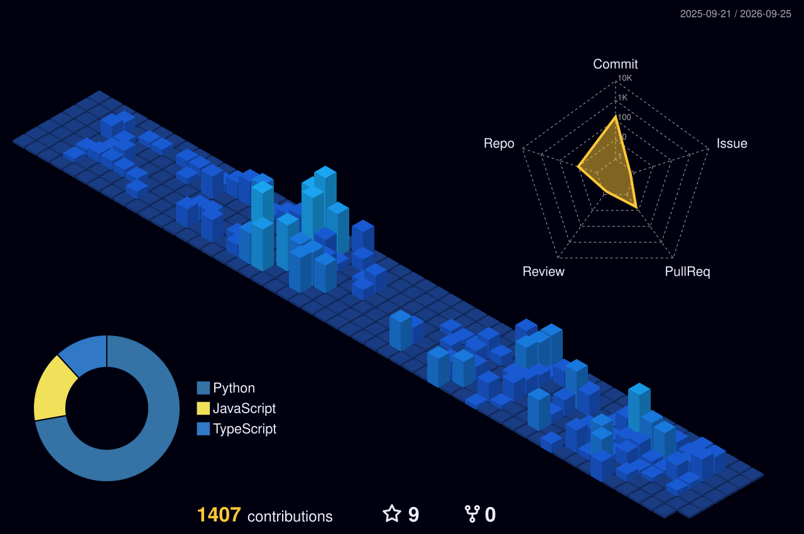

<picture>
  <source media="(prefers-color-scheme: dark)" srcset="assets/hero-dark.svg" />
  <source media="(prefers-color-scheme: light)" srcset="assets/hero-light.svg" />
  
</picture>

-0D1117?style=flat-square&labelColor=2F81F7&color=0D1117)

## 👋 About

I'm a Data Scientist and Associate Software Engineer focused on architecting intelligent, production-grade systems — I care more about pipelines that ship than ones that only work in a notebook. At **Acme One**, I contribute individually to **Nucleus One**, the company's core multi-module enterprise platform, after building my foundation by shadowing senior engineers across other internal systems. Independently, I'm designing a Retrieval-Augmented Generation platform aimed at solving document-heavy bottlenecks for professional services and local firms. I'm currently deepening that expertise toward the Microsoft **AI-103** (Azure AI Apps & Agents) certification.

## 📡 Core Tech Stack

## 🚀 Projects

> ⭐ **If any of these save you time or teach you something, a star helps more than you'd think** — it's what makes them discoverable to the next person who needs them.

**MFA Authentication Server** — Information Security capstone

Want to actually understand how TOTP/HOTP work instead of just importing a library that does it for you? Every OTP algorithm here is implemented straight from the RFC spec, by hand.

- **HOTP (RFC 4226) and TOTP (RFC 6238) implemented from the spec** — validated against `pyotp` as an independent test oracle, never used in production code
- AES-256-GCM encrypted secret vault, Argon2id password hashing, real WebAuthn/FIDO2 attestation and assertion verification
- **AI anomaly-detection layer** — IsolationForest scoring over login features (geo distance, impossible travel, new device, unusual hour) with Claude-generated plain-language alerts
- Streamlit admin dashboard for users, auth logs, and anomaly alerts

**Repo:** [Multi-Factor-Authentication-Protocols](https://github.com/Iambilalfaisal/Multi-Factor-Authentication-Protocols)

 

**Document Intelligence Platform for Professional Services** *(In Development)*

Ask your firm's own documents a question in plain English and get a cited answer back — instead of digging through folders. Built for law firms and accounting practices buried in paperwork.

- **Retrieval** — Azure AI Search over indexed firm documents
- **Generation** — Azure OpenAI Service, grounded strictly in retrieved context
- **Ingestion** — Azure AI Document Intelligence + Blob Storage for multi-format document processing
- **Trust layer** — inline citations back to source paragraphs on every answer
- **Access control** — Microsoft Entra identity integration

Built on top of Microsoft's production RAG reference architecture, which I forked and am extending toward this vertical use case.
**Repo:** [Project-Ease](https://github.com/Iambilalfaisal/Project-Ease)

 

**Automated Information Security Risk Assessment Platform** — UMT InfoSec semester project, Spring 2026

Turns a NIST SP 800-30 risk assessment from a spreadsheet exercise into a working app — asset inventory, live CVE matching, and auto-generated reports. Handy if you're studying for a security certification or building your first GRC tool.

- Risk engine covering asset, threat, and vulnerability management with live **CVE lookups via the NVD API**
- **LLM-generated control recommendations** (Claude, with a rule-based fallback when no API key is configured)
- Automated PDF reporting — risk register, cost-benefit analysis, and compliance checklists
- Flask REST API backing a Streamlit UI, with a React frontend also included

**Repo:** [Automated-Information-Security-Risk-Assessment-Platform](https://github.com/Iambilalfaisal/Automated-Information-Security-Risk-Assessment-Platform)

## 💼 Experience

**Acme One** · Lahore, Pakistan · 1 yr+

**Associate Software Engineer** · Full-time · Mar 2026 – Present
Contributing independently on **Nucleus One** — a production enterprise platform built on a React 18/TypeScript frontend and ASP.NET Core 8 / SQL Server backend — as one of the most active engineers on a 7-person team, #2 by commit volume across both repositories.

- **End-to-end delivery:** built **Project-One** entirely — database schema, backend logic, and frontend, including core workflow components like the work item management drawer
- **Service architecture:** authored core **HR module** services — employee onboarding, offboarding, and evaluation workflows — plus its database schema deployment
- **Platform security:** built the **authentication controller** for the Nucleus One core platform
- **Production deployment:** took **TimeTrace** to production, including its backend reporting engine

**Artificial Intelligence Intern** · Jul 2025 – Mar 2026
Engineered and deployed a Retrieval-Augmented Generation (RAG) chatbot directly into Nucleus One, enabling natural-language interaction with internal company data — the internship converted into the full-time Associate Software Engineer role above.

## 📜 Certifications

- **AI-103** — Designing and Implementing a Microsoft Azure AI Solution *(in progress)*
- **Claude Code in Action** — Anthropic, 2026
- **Claude Code 101** — Anthropic, 2026
- **AI Fluency Framework & Foundations** — Anthropic, 2026
- **AI Capabilities and Limitations** — Anthropic, 2026
- **Claude 101** — Anthropic, 2026

## 📊 GitHub Analytics

 

 

3D isometric render of my commit history

  

A jet flying over my real contribution grid, firing on the busiest days

## 🧬 Life & Code

Discipline outside the IDE is the same discipline that ships code on time.

| 🏋️ Training | 📚 Currently Reading | 🌍 Beyond the Desk |
| :--- | :--- | :--- |
| A two-muscle-group split, every session, chasing real strength and physique — currently in training for a marathon, with an actual finish position in mind, not just finishing. | *The Psychology of Money*, *Rich Dad Poor Dad*, *Genius Makers*, *The Subtle Art of Not Giving a F*ck*, plus books on dark psychology and persuasion. | Cricket, futsal, football, badminton, table tennis. Speak English, Punjabi, and Urdu, and read Arabic. Big on travel, cars, and multitasking by default. |

> "Sab bikta hai, sab khareedoon ga." — everything is for sale, and I'll buy it all.

## 📫 Connect

