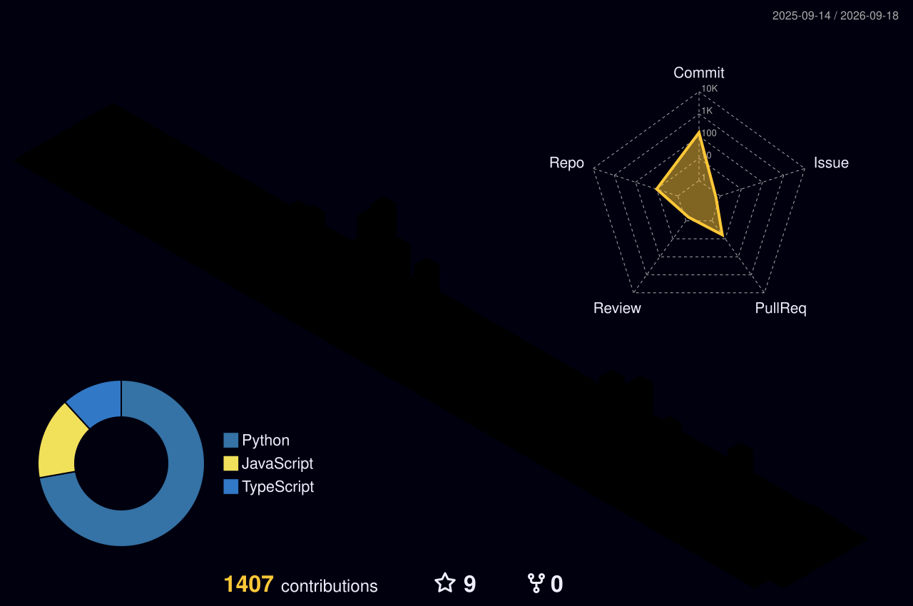

-0D1117?style=flat-square&labelColor=39FF14&color=0D1117)

 

## 👋 About

I'm a Data Scientist and Associate Software Engineer focused on architecting intelligent, production-grade systems — I care more about pipelines that ship than ones that only work in a notebook. At **Acme One**, I contribute individually to **Nucleus One**, the company's core multi-module enterprise platform, after building my foundation by shadowing senior engineers across other internal systems. Independently, I'm designing a Retrieval-Augmented Generation platform aimed at solving document-heavy bottlenecks for professional services and local firms. I'm currently deepening that expertise toward the Microsoft **AI-103** (Azure AI Apps & Agents) certification.

 

## 📡 Core Tech Stack

- 
- 
- 
- 
- 
- 
- 
- 
- 
- 

 

## 🚀 Currently Building

**Document Intelligence Platform for Professional Services** *(In Development)*

A RAG platform aimed at local law firms and accounting practices, designed to turn hours of manual document review into cited, conversational query responses.

- **Retrieval** — Azure AI Search over indexed firm documents
- **Generation** — Azure OpenAI Service, grounded strictly in retrieved context
- **Ingestion** — Azure AI Document Intelligence + Blob Storage for multi-format document processing
- **Trust layer** — inline citations back to source paragraphs on every answer
- **Access control** — Microsoft Entra identity integration

Built on top of Microsoft's production RAG reference architecture, which I forked and am extending toward this vertical use case.

**Repo:** [github.com/Iambilalfaisal/Project-Ease](https://github.com/Iambilalfaisal/Project-Ease)

 

## 💼 Experience

**Acme One** · Lahore, Pakistan · 1 yr+

**Associate Software Engineer** · Full-time · Mar 2026 – Present
Contributing independently on **Nucleus One** — a production enterprise platform built on a React 18/TypeScript frontend and ASP.NET Core 8 / SQL Server backend — as one of the most active engineers on a 7-person team, #2 by commit volume across both repositories.

- **End-to-end delivery:** built **Project-One** entirely — database schema, backend logic, and frontend, including core workflow components like the work item management drawer
- **Service architecture:** authored core **HR module** services — employee onboarding, offboarding, and evaluation workflows — plus its database schema deployment
- **Platform security:** built the **authentication controller** for the Nucleus One core platform
- **Production deployment:** took **TimeTrace** to production, including its backend reporting engine

**Artificial Intelligence Intern** · Jul 2025 – Mar 2026
Engineered and deployed a Retrieval-Augmented Generation (RAG) chatbot directly into Nucleus One, enabling natural-language interaction with internal company data — the internship converted into the full-time Associate Software Engineer role above.

 

## 📊 GitHub Analytics

 

 

## 🏙️ Contribution Cityscape

A 3D isometric render of my commit history, rebuilt daily by GitHub Actions.

 

## 🧬 Life & Code

Discipline outside the IDE is the same discipline that ships code on time.

| 🏋️ Consistent Execution | 📚 Continuous Learning |
| :--- | :--- |
| **Mon–Fri training, no off days.** Same reason a deploy pipeline doesn't get to skip a step: consistency compounds, gaps don't. | **Actively reading across** tech, psychology, sales, and personal finance. |

 

## 📫 Connect

